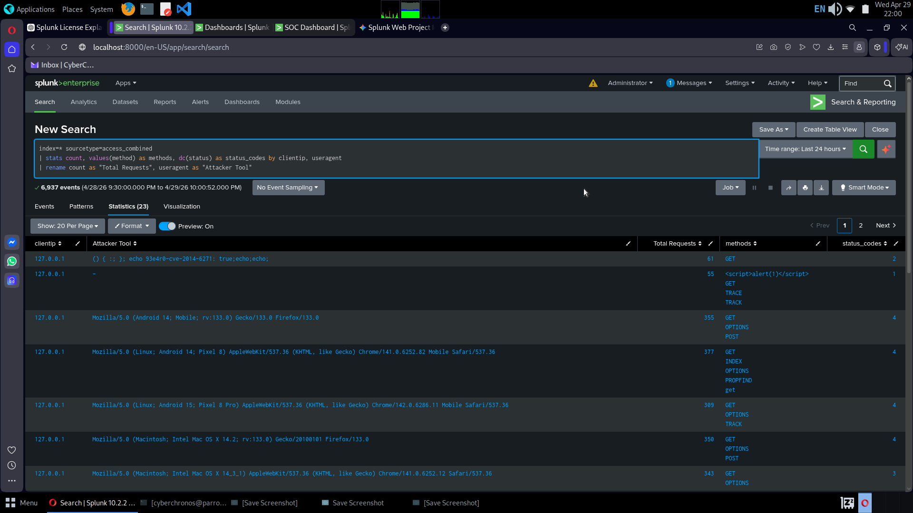

# 🛡️ Splunk SOC Dashboard: Threat Monitoring Project

## Overview
This project demonstrates a functional **Security Operations Center (SOC)** environment built in Splunk. I ingested raw Apache logs to identify real-world attack patterns, specifically focusing on automated vulnerability scanners and exploit attempts.

## 🚀 Key Visualizations
- **Global Attack Map:** Real-time geographic tracking of malicious traffic.
- **Attacker Signature Breakdown:** Identification of tools like the Nikto vulnerability scanner.
- **Vulnerability Forensics:** Deep-dive table catching **Shellshock (CVE-2014-6271)** and **XSS** strings.

## 📸 Dashboard Preview
 

## 🛠️ Skills Demonstrated
- SIEM Management (Splunk Enterprise)
- SPL (Splunk Processing Language)
- Cyber Threat Intelligence & Log Analysis
